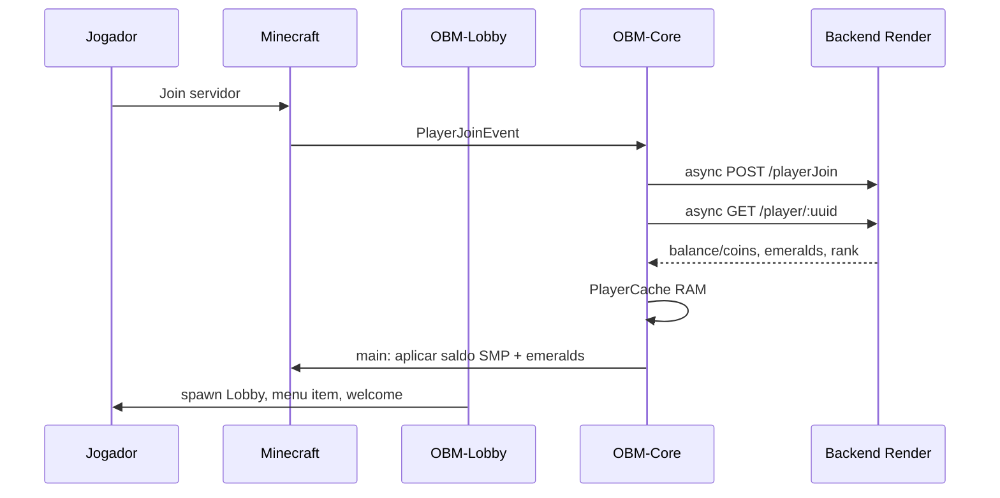
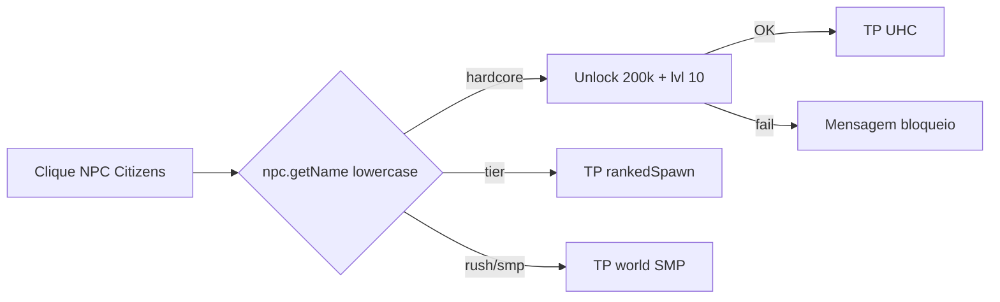

# Fluxo completo do servidor

Fluxo crítico: **lobby → modo → economia → backend → painel/dashboard**.

---

## 1. Player entra no servidor

**Fallback:** se API falha e `fallback-datastore: true` → lê `data.yml`.

**Header:** todas requests com `X-Plugin-Key`.

---

## 2. Interage com NPC (ou menu)

**Alternativa:** `/menu` → slots 12/13/14 (PvP, Hardcore, SMP) — mesma lógica teleporte.

**Nota:** NPC **não** verifica `obm.smp.enter`; comando `/smp` sim.

---

## 3. Entra num modo

| Modo | Mundo | Lock restore | Cooldown |
|------|-------|--------------|----------|
| Rush | world (+ nether/end) | `location_restore_locked_*` | `CooldownService` |
| Hardcore | UHC | idem | idem |
| TierSpace | rankedSpawn | idem | idem |

Scoreboard muda (`ScoreboardManager` + `WorldModeService`).

---

## 4. Ganha coins (exemplo Rush)

1. Kill / sell / reward → `EconomyService` ou `PlayerCacheService.depositCoins`.
2. **Só RAM:** `PlayerData.addCoins` → `pendingCoinDelta += amount`.
3. DataStore local actualizado para compat PAPI/offline.
4. Se ganho ≥ threshold → `POST /log` `COIN_GAIN` (async).

**Não há HTTP por cada coin** — evita lag.

---

## 5. Backend actualiza

| Trigger | Endpoint | Dados |
|---------|----------|-------|
| A cada 30s | `POST /money/add` | `{ uuid, amount }` delta |
| A cada 60s | `POST /stats/sync` | coins, kills, playtime absolutos |
| Quit | money/add flush + stats/sync | final |
| Join | GET player + playerJoin | load |

PostgreSQL coluna `coins` (API pode expor `balance` alias).

---

## 6. Dashboard / painel reflecte

| Sistema | O que vê |
|---------|----------|
| **obm-network-backend** | Dados `players` table, tops `/top/coins`, logs `/log` |
| **minespace-admin** | Audit bridge separado (`admin-bridge`), não coins live automático |
| **Hologramas lobby** | `GET /top/*` cache 60s → DecentHolograms |
| **PAPI in-game** | `%obm_coins%` etc. — cache/DataStore |

**Gap:** dashboard web unificado com coins em tempo real depende de consumir mesma API PostgreSQL — não está 100% wired no repo minespace-admin para economia jogador.

---

## Fluxo resumido (texto)

1. Join → carregar jogador na API → cache.  
2. Lobby → escolher modo (NPC/menu).  
3. Jogar → economia só memória.  
4. Background → sync deltas + stats.  
5. Quit → flush final.  
6. Leaderboards/hologramas → leitura API periódica.
