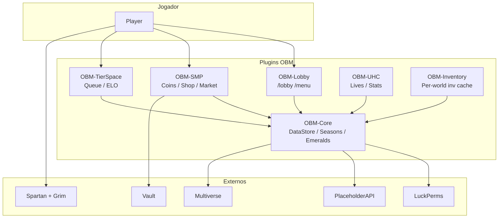

# MineSpace / OMD Network — Visão geral do servidor

Documento de referência permanente para desenvolvimento (Cursor context). Descreve arquitectura, modos, economia, segurança, dados e workflow de deploy.

**Documentos relacionados:**

| Tópico | Ficheiro |
|--------|----------|
| Arquitectura seasons (detalhe) | [`NETWORK_ARCHITECTURE.md`](NETWORK_ARCHITECTURE.md) |
| LuckPerms produção | [`luckperms-production.md`](luckperms-production.md) |
| Spartan anti-cheat | [`../server-config/anticheat/spartan/README.md`](../server-config/anticheat/spartan/README.md) |
| MythicMobs spawn SMP | [`../server-config/mythicmobs/README.md`](../server-config/mythicmobs/README.md) |
| LP comandos executáveis | [`../config/luckperms/production-setup.txt`](../config/luckperms/production-setup.txt) |
| LP delta segurança v2 | [`../config/luckperms/production-delta-v2.txt`](../config/luckperms/production-delta-v2.txt) |
| Regras assistente Cursor | [Secção 13](#13-regras-para-assistente-cursor) (neste ficheiro) |

---

## 1. Arquitectura do servidor

### 1.1 Visão geral

**MineSpace** é uma network Minecraft (Spigot/Paper **1.20+**, Java **17**) num único servidor multiverso. Os jogadores circulam entre **Lobby**, **RushSMP**, **TierSpace (ranked PvP)**, **UHC/Hardcore** e dimensões associadas (nether/end).

Não há proxy BungeeCord no repo: a network é gerida por **Multiverse-Core** + plugins OBM que classificam mundos via `WorldModeService`.

### 1.2 Módulos Maven (código-fonte)

Agregador: `pom.xml` (`omd-network-parent`).

| Módulo | Artefacto | Dependências | Papel |
|--------|-----------|--------------|--------|
| **OBM-Core** | `OBM-Core.jar` | PAPI, DecentHolograms, LP (soft) | Núcleo: dados, economia global, seasons, lojas network, cosmetics, combat log, PAPI, hologramas |
| **OBM-SMP** | `OBM-SMP.jar` | **OBM-Core**, Vault (soft) | RushSMP: coins, shop, sell, auction, market, ranks SMP, progression |
| **OBM-TierSpace** | `OBM-TierSpace.jar` | **OBM-Core**, Grim/Spartan (soft) | Ranked PvP, filas, ELO, seasons ranked |
| **OBM-Lobby** | `OBM-Lobby.jar` | **OBM-Core** | Hub: `/lobby`, `/menu`, GUIs de modo, join UX |
| **OBM-UHC** | `OBM-UHC.jar` | **OBM-Core**, OBM-Lobby (soft) | Hardcore UHC: vidas, stats, revive staff |
| **OBM-Inventory** | `OBM-Inventory.jar` | **OBM-Core** | Cache de inventário por mundo (complementa `DataStore`) |

**Ordem de arranque:** Core → SMP / TierSpace / Inventory / UHC / Lobby (Lobby por último para menus).

### 1.3 Plugins externos (runtime)

Configuração em `plugins/` — **não é código-fonte**. Alterações versionadas em `server-config/` quando aplicável.

| Plugin | Função na network |
|--------|-------------------|
| **LuckPerms** | Grupos, permissões, prefixos |
| **Essentials** | Homes, TPA, spawn auxiliar — **economia desactivada** |
| **Vault** | Ponte economia SMP |
| **PlaceholderAPI** | TAB, chat, hologramas (`%obm_*%`) |
| **TAB** | Tablist, nametags, scoreboard por grupo |
| **DecentHolograms** | Hologramas (Core pode gerir via `holograms.yml`) |
| **Citizens** | NPCs lobby / filas |
| **MythicMobs** | Mobs custom — **sem random spawn no SMP** |
| **Multiverse-Core** | Mundos múltiplos |
| **WorldEdit / VoxelSniper** | Builder (limites por LP) |
| **Spartan + GrimAC** | Anti-cheat em camadas |
| **voicechat**, **JumpPads**, **VoidGen** | QoL / geração |

### 1.4 Diagrama de interacção (simplificado)



### 1.5 Pastas do repositório

| Pasta | Uso |
|-------|-----|
| `OBM-*/src/` | **Único** código-fonte de plugins custom |
| `plugins/` | Runtime do servidor (JARs + YAML) — copiar, não editar como dev |
| `server-config/` | Templates versionados (anticheat, mythicmobs, grim) |
| `config/luckperms/` | Scripts LP para produção |
| `PluginsCompilados/` | Saída `mvn install` dos JARs OBM |
| `docs/` | Documentação |

---

## 2. Modos de jogo

Mundos configuráveis em `OBM-Core/config.yml` (`smp-worlds`, `uhc-worlds`, `ranked-worlds`, `lobby.world`).

### 2.1 Lobby

| Aspeto | Detalhe |
|--------|---------|
| **Objetivo** | Hub central: escolher modo, social, leaderboards |
| **Mundo típico** | `Lobby` |
| **Sistemas** | Menu (`/menu`), `/lobby`, hologramas, item de menu, protecções (sem drop/dano), scoreboard lobby |
| **Inventário** | Limpo no join; compass/menu — `OBM-Inventory` + `JoinHandler` |
| **Diferença** | Sem economia SMP, sem combat log persistente, ignorado por `GlobalStorageListener` para restore de modo |

### 2.2 RushSMP (SMP)

| Aspeto | Detalhe |
|--------|---------|
| **Objetivo** | Survival competitivo com economia, ranks, PvP, progressão |
| **Mundos** | `world`, `world_nether`, `world_the_end` (configurável) |
| **Sistemas** | Coins, `/shop`, `/sell`, `/ah`, `/market`, `/money pay`, ranks bronze→emerald, level/XP, spawn protection, milestones playtime, `/top` |
| **Season** | `smp` — reset coins/stats/progression via `/season smp` (admin) |
| **Diferença** | Economia **Coins**; inventário guardado em `DataStore` modo `smp`; anti-farm kills |

### 2.3 TierSpace (Ranked)

| Aspeto | Detalhe |
|--------|---------|
| **Objetivo** | PvP ranked por modo (ELO, placement, seasons) |
| **Mundos** | `TierSpace`, `rankedSpawn` (hub + arenas) |
| **Sistemas** | `/queue`, `/tierspace`, matchmaking, rating K-factor, daily quests ranked, post-match GUI |
| **Season** | `ranked` — ELO reset suave (`TierSeasonManager` / `/season ranked`) |
| **Diferença** | Foco em **ELO**, não coins; protecção de comandos em match; Grim/Spartan mais activos em PvP |

### 2.4 UHC / Hardcore

| Aspeto | Detalhe |
|--------|---------|
| **Objetivo** | Ultra hardcore com vidas limitadas |
| **Mundos** | `UHC`, `UHC_nether`, `UHC_the_end` |
| **Sistemas** | Vidas, eliminação, stats, `/uhcstats`, revive staff (`uhc.revive`) |
| **Season** | **Nenhuma** — `SeasonService` bloqueia reset hardcore |
| **Diferença** | Dados permanentes; respawn End → overworld UHC; pode enviar a lobby após eliminação |

---

## 3. Sistema de economia

### 3.1 Duas moedas

| Moeda | Onde vive | Uso principal |
|-------|-----------|---------------|
| **Emeralds** | `OBM-Core` (`GlobalEconomyService`, `data.yml`) | Loja global, cosmetics, crates, battle pass, ranks **network**, daily rewards, leaderboards |
| **Coins** | `OBM-SMP` + **Vault** | Shop SMP, sell, auction, market, ranks **SMP**, pay entre jogadores |

**Regra:** Essentials **não** gere economia. Comandos `pay`, `balance`, `bal`, `eco` desactivados em `plugins/Essentials/config.yml`. Jogadores usam `/money` e `/money pay` (OBM).

### 3.2 Emeralds (global)

- Ganhos: daily (`/daily`), recompensas configuradas (`global-economy.rewards`), ranked win, playtime SMP/UHC, admin panel.
- Limites: `daily-cap`, `per-minute`, `max-per-grant`, cooldowns por tipo (`config.yml`).
- Anti-farm: cooldown kill SMP, caps por sessão.
- PAPI: `%obm_emeralds%`, `%obm_global_emeralds%`.

### 3.3 Coins (SMP)

- Saldo inicial: `OBM-SMP/config.yml` → `starting-balance`.
- Kill/death: recompensa/penalidade configurável.
- Ranks SMP: boosts sell/kill/shop discount (`ranks.levels.*`).
- PAPI: `%obm_coins%`, `%obm_money%`, `%obm_balance%`.
- Vault expõe saldo para plugins externos compatíveis.

### 3.4 Prevenção de exploits (economia)

| Mecanismo | Implementação |
|-----------|----------------|
| Pay cooldown | 30s entre envios (`economy.pay.cooldown-seconds`) |
| Pay limite diário | 50 000 coins/dia enviados (`daily-send-limit`) |
| Pay log grande | Transacções ≥ 10 000 logadas |
| Market cooldown | 45s entre listagens (`market.listing-cooldown-seconds`) |
| Market limites | 8 listings/jogador, preço min/max |
| Kill farm | Cooldown 30 min mesma vítima (`exploits.kill-cooldown-minutes`) |
| Essentials pay | Desactivado (evita duplicar com OBM) |
| Admin bypass | `obm.smp.admin` — só staff |

---

## 4. Sistemas principais (OBM-Core)

Configuração modular: ficheiros em `OBM-Core/src/main/resources/` fundidos no arranque via `ModularConfigLoader`.

| Sistema | Config | Comando / acesso | Permissão |
|---------|--------|------------------|-----------|
| **Seasons** | `season.yml` | `/season [smp\|ranked\|hardcore] ...` | `obm.season.info` / `obm.admin.season` |
| **Crates** | `crates.yml` | `/crate` | `obm.crate` |
| **Cosmetics** | `cosmetics.yml` | `/cosmetics` | `obm.cosmetics` |
| **Battle Pass** | `battlepass.yml` | `/battlepass` | `obm.battlepass` |
| **Loja global** | `global-shop.yml` | `/shopglobal` | `obm.shop.global` |
| **Daily** | `daily-rewards.yml` | `/daily` | `obm.daily` |
| **Ranks network** | `network-ranks.yml` | LP dispatch ao comprar rank | via Emeralds |
| **Leaderboards** | `config.yml` + serviços | Hologramas / `/top` SMP | — |
| **Chat** | `chat-format.yml` | Chat + `!` staff | `obm.chat.color`, `obm.chat.staff` |
| **Admin panel** | — | `/adminpanel` | `obm.admin.panel` + `obm.admin.season` para acções season |
| **Hologramas** | `holograms.yml` | DecentHolograms API | — |

**Seasons separadas:** não existe reset global. Ver [`NETWORK_ARCHITECTURE.md`](NETWORK_ARCHITECTURE.md).

---

## 5. Sistema de permissões

### 5.1 Hierarquia LuckPerms

```
default → vip → mvp
default → builder (ramo paralelo)
default → helper → mod → admin → owner
```

| Grupo | Peso | Papel resumido |
|-------|------|----------------|
| **DEFAULT** | 0 | Jogador: todos os modos base, economia, TierSpace fila |
| **VIP** | 10 | QoL: chat color, loja VIP SMP, 2ª home |
| **MVP** | 20 | QoL+: prefix, workbench, mais homes |
| **BUILDER** | 15 | WorldEdit/Voxel/Citizens — **sem** staff |
| **HELPER** | 30 | Kick, mute, vanish, tp, `obm.chat.staff` |
| **MOD** | 40 | Ban, invsee, fly staff, Grim alerts — **sem** bypass AC |
| **ADMIN** | 50 | Seasons, painel OBM, revive UHC, WE extra |
| **OWNER** | 100 | LP/TAB/PAPI reload, bypass AC (único grupo recomendado) |

### 5.2 Permissões OBM críticas

**Jogador (DEFAULT):** `obm.lobby`, `obm.menu`, `obm.smp.*` (enter, shop, sell, auction, rank, money, pay, market, top), `obm.tierspace.use`, `obm.tierspace.queue`, `obm.uhc.stats`, `obm.shop.global`, `obm.daily`, `obm.cosmetics`, `obm.crate`, `obm.battlepass`, `obm.season.info`.

**Staff:** `obm.stats` (ver stats alheios), `obm.admin.panel`, `obm.admin.season`, `obm.smp.admin`, `uhc.revive`, ranks `obm.rank.*`.

### 5.3 Regras de segurança (permissões)

- **Nunca** `*`, `essentials.*`, `worldedit.*`, `luckperms.*` em jogadores.
- **Nunca** `essentials.pay` / `essentials.eco` / `essentials.give` em default/vip/mvp.
- **Bypass AC:** preferir só **OWNER** (`spartan.bypass`, `grim.exempt`); ADMIN sem bypass por defeito (delta v2).
- **WorldEdit:** permissões **nomeadas** + `worldedit.limit.50000` builder; default 8000, max 100000 em `WorldEdit/config.yml`.
- Um grupo principal por jogador + `parent add` para extras (ex. builder).

Detalhe completo: [`luckperms-production.md`](luckperms-production.md).

---

## 6. Segurança

### 6.1 Anti-cheat (Spartan + Grim)

| Camada | Função | Config versionada |
|--------|--------|-------------------|
| **Spartan** | Detecção ampla (movement, combat, inventory) | `server-config/anticheat/spartan/` |
| **GrimAC** | Simulação movimento, knockback, reach | `server-config/anticheat/grim/` |

**Filosofia actual (Spartan):**

- Checks **activos**, `cancelled_event: true` em movimento (`gravity-simulation`, `speed-simulation`, `velocity`, `irregular-movements`).
- **`punishments.enabled: false`** em todos os checks — sem `spartan kick` automático.
- Sensibilidade: `minimum_gravity_difference: 0.15`, `minimum_speed_difference: 0.08`.
- `ground_teleport_on_detection: false` (menos rubber-band).

**Grim:** kicks configuráveis em `punishments.yml` — revisar antes de produção (fase alert/log recomendada em ranked).

**Integração código:** `SpartanBridge` — grace após respawn/join; `SmpRespawnListener` + `PlayerJoinStabilizeListener`.

### 6.2 Protecções gerais

- **Combat log:** 15s (`combatlog.timeout`); comandos bloqueados configuráveis — **`lobby`/`hub` nunca bloqueados**.
- **Chat anti-spam:** 1,5s (`chat.anti-spam-cooldown-ms`); staff com `obm.chat.staff` bypass + chat `!`.
- **Admin audit:** `AdminAuditLog` para acções season/painel.
- **Spawn protection SMP:** raio 100 blocos (`OBM-SMP` config).
- **OP:** `op_bypass: false` no Spartan settings.

### 6.3 Rate limits (código)

| Acção | Limite |
|-------|--------|
| `/money pay` | 30s cooldown, 50k/dia (`SmpRateLimits`) |
| `/market` list | 45s entre listagens |
| Chat | 1,5s entre mensagens (não-staff) |

### 6.4 Problemas já corrigidos (referência)

| Problema | Solução |
|----------|---------|
| Spartan `gravity-simulation` kick FP | Punish off + cancel on + tolerância advanced.yml |
| Perda inventário no kick | `CriticalPlayerSaveListener` + `PlayerPersistence.saveForce()` |
| Player void/chunks após kick | `PlayerJoinStabilizeListener` + `PlayerMovementStabilizer` |
| `/lobby` bloqueado em combat | Removido de `blocked-commands`; `LobbyCommand.force-always` |
| Skeleton King no SMP | `ExampleRandomSpawns.yml` — mundo `__disabled_no_smp__`, chance 0 |

---

## 7. Configurações importantes

### 7.1 OBM-Core (`plugins/OBM-Core/`)

| Ficheiro | Conteúdo |
|----------|----------|
| `config.yml` | Mundos, combatlog, lobby spawn, join-stabilize, global-economy, chat |
| `data.yml` | **Dados jogadores** (gerado — backup antes de season reset) |
| `season.yml` | Modos season |
| `global-shop.yml`, `cosmetics.yml`, `crates.yml`, `battlepass.yml`, `daily-rewards.yml`, `network-ranks.yml`, `holograms.yml`, `chat-format.yml` | Sistemas network |

### 7.2 OBM-SMP

| Ficheiro | Conteúdo |
|----------|----------|
| `config.yml` | Economia, pay/market limits, ranks, respawn stabilize |
| `shop-catalog.yml` | Itens loja |

### 7.3 OBM-Lobby / TierSpace / Inventory

- `OBM-Lobby/config.yml` — spawn lobby, `lobby.command.force-always`
- `OBM-TierSpace/config.yml` — rating, placement, season ranked
- `OBM-Inventory/config.yml` — mapeamento mundo → inventário

### 7.4 Externos críticos

| Plugin | Ficheiro | Notas |
|--------|----------|-------|
| **Essentials** | `config.yml` | `pay`, `balance`, `bal`, `eco` na lista disabled |
| **WorldEdit** | `config.yml` | `max-blocks-changed` default 8000, max 100000 |
| **Spartan** | `checks.yml`, `advanced.yml`, `settings.yml` | Copiar de `server-config/anticheat/spartan/` |
| **GrimAC** | `punishments.yml`, `config.yml` | Copiar de `server-config/anticheat/grim/` |
| **MythicMobs** | `randomspawns/ExampleRandomSpawns.yml` | Sem spawn no `world` SMP |
| **TAB** | `config.yml` | Placeholders `%obm_coins%`, `%obm_emeralds%` |
| **LuckPerms** | Base de dados / exports | Scripts em `config/luckperms/` |

---

## 8. Sistema de dados

### 8.1 DataStore (`OBM-Core`)

- Ficheiro único: `plugins/OBM-Core/data.yml`.
- Lock sincronizado — evita corrupção entre Core e SMP.
- Dados por jogador: stats, flags, inventários `mode.smp` / `mode.uhc`, localizações por modo, Emeralds, progressão.

### 8.2 Fluxo de persistência

| Evento | Componente | Acção |
|--------|------------|--------|
| **Kick** (incl. Spartan) | `CriticalPlayerSaveListener` LOWEST + MONITOR | `PlayerPersistence.savePlayer(KICK)` → `saveForce()` |
| **Quit** | `CriticalPlayerSaveListener` HIGHEST | Save completo |
| **Death** | `CriticalPlayerSaveListener` HIGHEST | Save completo |
| **Inventário** | Debounce 2s após click/drop/pickup | Save inventário |
| **Mudança mundo** | `GlobalStorageListener` + `InventoryListener` | Save/load inventário e localização |
| **Portal / teleport entre modos** | `GlobalStorageListener` | Save inventário modo origem + flush |

### 8.3 PlayerPersistence

- Clona inventário antes de gravar.
- Sincroniza economia SMP via `EconomyBridge`.
- Opcional: reflect `OBM-Inventory` cache.
- **`saveForce()`** — flush em disco mesmo sem dirty (kick/quit críticos).

### 8.4 Prevenção de rollback

- `saveForce()` em momentos críticos.
- Backup automático: `DataStore.backup(label)` antes de season reset.
- Pasta `plugins/OBM-Core/backups/`.
- Não duplicar save quit em `PlayerConnectionListener` SMP (delegado ao Core).

### 8.5 OBM-Inventory

- Cache por nome de mundo; load/save em `PlayerChangedWorldEvent` (delay 6 ticks).
- Complementa YAML do Core; **fonte de verdade** para inventário de modo é `DataStore` + `PlayerPersistence`.

---

## 9. Problemas conhecidos e riscos residuais

### 9.1 Edge cases

| Caso | Comportamento / risco |
|------|------------------------|
| Join com restore atrasado (10 ticks) + stabilize (2 ticks) | Possível “flash” de posição antes do restore `GlobalStorageListener` |
| Dois AC activos (Spartan + Grim) | Flags duplicadas em movimento legítimo — monitorizar logs |
| Pay race condition | Dois pays simultâneos — sem lock distribuído |
| TierSpace match + comandos | Bloqueio parcial em `MatchProtectionListener` |
| Hardcore | Sem season reset — resets manuais perigosos |

### 9.2 Riscos residuais

- Grim ainda pode kickar se `punishments.yml` tiver kicks activos.
- OP no servidor bypassa algumas protecções Bukkit.
- `plugins/` no repo pode divergir do servidor live — sempre validar deploy.
- MythicMobs: spawners manuais (`spawners/*.yml`) ainda podem existir — rever mundos em cada ficheiro.

### 9.3 Limitações actuais

- Sem proxy multi-servidor: tudo num JVM.
- Permissões LP não versionadas automaticamente no repo (só scripts texto).
- Battle pass / crates: balanceamento só via YAML.
- Bedrock: prefixo `.` Spartan; testar separadamente.

---

## 10. Regras de desenvolvimento

Resumo executivo — regras completas para o assistente Cursor em **[secção 13](#13-regras-para-assistente-cursor)**.

1. **Código-fonte apenas em `OBM-*/src/`** — nunca tratar `plugins/*.jar` como projeto Java.
2. **`plugins/`** = configs runtime; templates em `server-config/`.
3. **Sem permissões wildcard** (`*`) em LP.
4. **Validar impacto gameplay** antes de mudar economia, AC ou save.
5. **`mvn install` OBM-Core** antes de módulos dependentes.
6. **Commits** só quando pedido; evitar commitar `data.yml` com dados reais.

---

## 11. Deploy e workflow

### 11.1 Compilar

```bash
cd "D:\PluginsMinecraft\OMD Network"
mvn clean install -DskipTests
```

JARs gerados em `PluginsCompilados/` (ou `OBM-*/target/*.jar`).

### 11.2 Copiar para o servidor

```
PluginsCompilados/OBM-Core.jar      → plugins/
PluginsCompilados/OBM-SMP.jar       → plugins/
PluginsCompilados/OBM-TierSpace.jar → plugins/
PluginsCompilados/OBM-Lobby.jar     → plugins/
PluginsCompilados/OBM-UHC.jar       → plugins/
PluginsCompilados/OBM-Inventory.jar → plugins/
```

**Merge configs** (não substituir cegamente `data.yml`):

- Novas chaves de `OBM-Core/src/main/resources/config.yml` → `plugins/OBM-Core/config.yml`
- Idem para SMP, Lobby, TierSpace.

### 11.3 Configs externas (templates)

```
server-config/anticheat/spartan/*  → plugins/Spartan/
server-config/anticheat/grim/*     → plugins/GrimAC/   (se existir)
server-config/mythicmobs/*           → plugins/MythicMobs/
```

Reload: `/spartan reload`, `/grim reload`, `/mm reload`, reinício para OBM.

### 11.4 LuckPerms

1. Consola: colar `config/luckperms/production-setup.txt` (setup inicial).
2. Se já aplicado: `config/luckperms/production-delta-v2.txt`.
3. Verificar: `lp user <nick> info`, testar comandos default.

### 11.5 Testar (smoke)

1. Join lobby → menu → SMP → inventário mantém.
2. Jump + água 60s → sem kick Spartan.
3. Simular kick → rejoin sem void; inventário igual.
4. `/lobby` em combate → teleport OK.
5. `/money pay` → cooldown; market → cooldown.
6. Mundo SMP → sem Skeleton King aleatório.
7. Builder: `//set` dentro do limite; default sem WE.

---

## 12. Checklist de produção

### Permissões

- [ ] `production-setup.txt` ou delta v2 aplicado
- [ ] DEFAULT com `obm.lobby`, `obm.smp.money.pay`, TierSpace, UHC stats
- [ ] Sem `essentials.pay` / `*` em jogadores
- [ ] OWNER único com bypass AC (se desejado)

### Configs

- [ ] `OBM-Core/config.yml` — join-stabilize, combatlog sem lobby, lobby.spawn
- [ ] `OBM-SMP/config.yml` — pay/market rate limits
- [ ] Essentials pay/balance desactivados
- [ ] WorldEdit limits 8000/100000
- [ ] Spartan checks.yml + advanced.yml (punish false, cancel true)
- [ ] MythicMobs random spawns desactivados no SMP
- [ ] TAB com placeholders OBM

### Código / JARs

- [ ] `mvn clean install` sem erros
- [ ] Todos os 6 JARs OBM no servidor
- [ ] Versões alinhadas (mesma build)

### Segurança e dados

- [ ] Kick test → log `[OBM-SAVE]`
- [ ] Inventário persiste após kick
- [ ] `/lobby` sempre funcional (`force-always: true`)
- [ ] Grim punishments revistos (kick ou só alert)

### Gameplay

- [ ] Filas TierSpace funcionais
- [ ] Season info correcta por modo
- [ ] NPCs/Citizens lobby OK
- [ ] Voice chat / jump pads (se usados) sem conflito

---

## 13. Regras para assistente (Cursor)

Regras **obrigatórias** para qualquer alteração no projeto quando este documento é usado como contexto permanente.

### 13.1 Estrutura do projeto

**Código-fonte (lógica Java):**

- `OBM-Core`
- `OBM-SMP`
- `OBM-TierSpace`
- `OBM-Lobby`
- `OBM-UHC`
- `OBM-Inventory`

Toda a lógica Java deve ser implementada nestes módulos.

**Pasta `plugins/`**

| Permitido | Proibido |
|-----------|----------|
| Configs runtime (`.yml`) | Editar código / comportamento base |
| Valores, layout visual | Tratar como projeto Java |
| JARs compilados (deploy) | Modificar `.jar` no repo como fonte |

**Pasta `PluginsCompilados/`**

- Contém JARs gerados pelo build.
- **Não editar** — apenas copiar para `plugins/` no servidor.

**Templates versionados:** `server-config/`, `config/luckperms/` — replicar alterações para `plugins/` no deploy.

### 13.2 Regras de desenvolvimento

1. Trabalhar em `OBM-*/src/` para lógica Java; alterar `plugins/` **só** para configs.
2. Ao editar configs, descrever **antes / depois** e impacto em gameplay.
3. **Não assumir** comportamento — confirmar no código real (`grep`, leitura de classes).
4. Priorizar **estabilidade** sobre features novas.
5. **Não duplicar** sistemas existentes (usar `DataStore`, bridges, serviços Core).
6. `mvn install` em **OBM-Core** antes de compilar módulos dependentes.

### 13.3 Segurança

**Nunca atribuir em jogadores:**

- `*`, `essentials.*`, `worldedit.*`, `luckperms.*`

**Controlar com cuidado:**

- `spartan.bypass`, `grim.exempt` — preferir só **OWNER**
- `obm.admin.panel`, `obm.admin.season`, `obm.smp.admin`

**Anti-cheat:**

- Detectar: sim.
- Punir agressivamente (kick automático em FP): não.
- Ver secção 6 e `server-config/anticheat/spartan/`.

### 13.4 Dados (crítico)

| Momento | Obrigatório |
|---------|-------------|
| `PlayerQuitEvent` | Save completo (`CriticalPlayerSaveListener`) |
| `PlayerKickEvent` | Save + `saveForce()` (LOWEST + MONITOR) |
| Inventário / teleporte entre modos | `PlayerPersistence` + flush |

- Nunca confiar num único save assíncrono sem flush em kick/quit.
- Evitar rollback de inventário; não reintroduzir save duplicado no SMP quit se Core já guarda.
- Backup `data.yml` antes de season reset (`DataStore.backup`).

### 13.5 Economia

| Usar (OBM) | Não usar (Essentials) |
|------------|------------------------|
| `/money`, `/money pay` | `pay`, `balance`, `eco` |

Sempre respeitar cooldowns e rate limits em `OBM-SMP/config.yml` (`SmpRateLimits`). Logs em transacções grandes.

### 13.6 Anti-cheat

Spartan / Grim devem tolerar gameplay legítima:

- jump spam, água, velocity, wind charges, knockback PvP, slime blocks.

Config Spartan: punish off, cancel on em checks de movimento. Revisar Grim `punishments.yml` antes de produção.

### 13.7 Estado do jogador

Corrigir e não regressar:

- void / chunks após kick ou join bugado;
- desync cliente/servidor.

Usar `PlayerJoinStabilizeListener`, `PlayerMovementStabilizer`, `LobbySpawnService`, `SafeSpawnService`.

### 13.8 MythicMobs

- Mobs custom **não** devem spawnar aleatoriamente no SMP (`world`).
- Limitar a mundos de dungeon via `spawners/` ou `Worlds:` explícitos.
- Rever `randomspawns/` e `spawners/*.yml` em cada alteração de mobs.

### 13.9 Comandos

**`/lobby` deve funcionar sempre:**

- `lobby.command.force-always: true` no OBM-Lobby;
- `lobby`/`hub` excluídos de `CombatCommandBlocker`;
- limpar combat + estabilizar movimento antes do teleporte.

### 13.10 Deploy (workflow obrigatório)

1. Código → módulos `OBM-*`
2. `mvn clean install -DskipTests`
3. JARs → `PluginsCompilados/`
4. Copiar JARs → `plugins/` do servidor
5. Merge configs (nunca substituir `data.yml` cegamente)
6. Aplicar LuckPerms (`production-setup.txt` ou delta v2)
7. Smoke tests (secção 11.5)

### 13.11 Testes obrigatórios (pré-produção)

- Sem kicks injustos (Spartan/Grim)
- Inventário mantém-se após kick
- `/lobby` em combate e após kick AC
- Economia: cooldowns pay/market activos
- Mobs custom controlados no SMP
- Builder dentro dos limites WorldEdit

### 13.12 Debugging rápido

| Sintoma | Onde verificar |
|---------|----------------|
| Jogador no void | `join-stabilize` em OBM-Core; logs join |
| Inventário perdido | `CriticalPlayerSaveListener`, `[OBM-SAVE]` no log |
| Kick Spartan | `plugins/Spartan/checks.yml`, `advanced.yml` |
| Mobs estranhos no SMP | `MythicMobs/randomspawns/`, `spawners/` |
| Comando falha | LuckPerms `lp user <nick> info`, `plugin.yml` |
| `/lobby` bloqueado | `combatlog.blocked-commands`, `LobbyCommand` |

### 13.13 Prioridades

| Prioridade | Área |
|------------|------|
| **Alta** | Estabilidade, persistência de dados, segurança (perms + AC + economy) |
| **Média** | UX (TAB, chat, scoreboard, hologramas) |
| **Baixa** | Features novas sem necessidade clara |

### 13.14 Anti-exploit

- Validar **server-side** (nunca confiar só no cliente).
- Cooldowns e limites em pay, market, chat, rewards.
- Evitar permissões amplas; auditoria em acções admin (`AdminAuditLog`).
- Sem wildcards em LP.

### 13.15 Regra final

1. **Nunca** quebrar sistemas existentes sem migração clara.
2. **Nunca** sacrificar estabilidade por features.
3. **Sempre** integrar com Core, `DataStore`, bridges e convenções do repo.

---

## Apêndice A — Comandos rápidos por modo

| Comando | Modo | Permissão |
|---------|------|-----------|
| `/lobby` | Lobby | `obm.lobby` |
| `/menu` | Lobby | `obm.menu` |
| `/smp` | SMP | `obm.smp.enter` |
| `/shop`, `/sell`, `/ah`, `/money`, `/market`, `/rank`, `/top` | SMP | ver `plugin.yml` SMP |
| `/queue`, `/tierspace` | TierSpace | `obm.tierspace.queue` / `.use` |
| `/uhcstats` | UHC | `obm.uhc.stats` |
| `/daily`, `/cosmetics`, `/crate`, `/battlepass`, `/shopglobal` | Network | Core perms |
| `/season` | Admin/info | `obm.season.info` / `obm.admin.season` |
| `/adminpanel` | Admin | `obm.admin.panel` |
| `/stats` | Staff | `obm.stats` |

## Apêndice B — Placeholders PAPI (`obm`)

Exemplos: `%obm_coins%`, `%obm_emeralds%`, `%obm_level%`, `%obm_rank%`, `%obm_tier_rating%`, `%obm_season_smp%`, `%obm_combat_time%`. Lista completa em `OBMExpansion.java`.

---

*Última actualização: inclui secção 13 (regras Cursor). Manter sincronizado quando alterar arquitectura, permissões ou sistemas críticos.*
