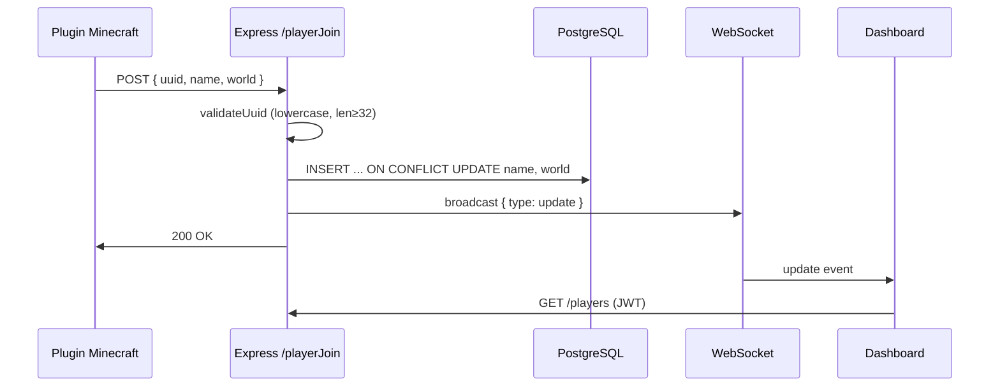
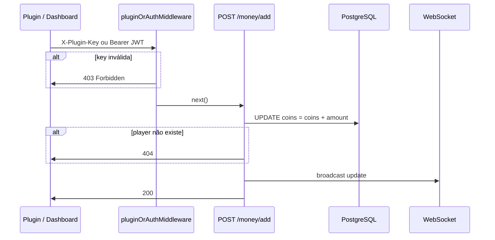
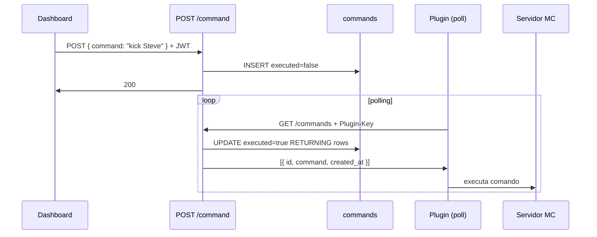
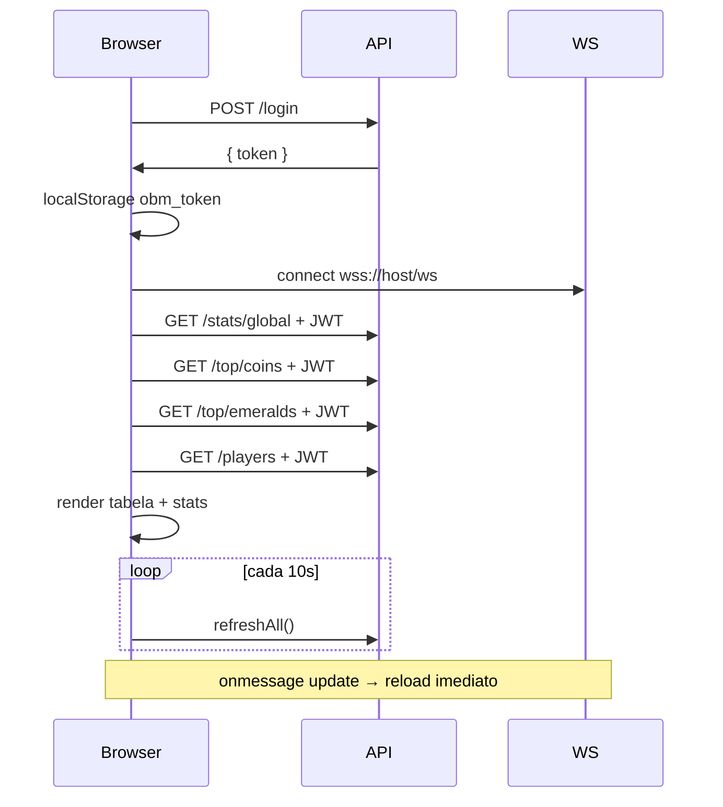

# Fluxos de operação

## 1. Player Join



**Auth:** público — plugin não precisa de key para join.

---

## 2. Ganho de coins



**Nota:** Dashboard usa amount negativo para remover coins.

---

## 3. Execução de comandos remotos



**Atómico:** GET marca todos pendentes como executados numa única query.

---

## 4. Dashboard load



---

## 5. Admin log + Discord

```
POST /log { staff, action, target, value }
  → INSERT logs
  → notifyAdminLog() → Discord webhook (async, não bloqueia)
  → 200
```

---

## 6. Stats sync (plugin → leaderboard)

```
POST /stats/sync { uuid, name, coins, emeralds, kills, playtime }
  → UPSERT players (valores absolutos)
  → broadcast update
  → { ok: true, uuid }
```

Usado quando o plugin envia snapshot completo do player (não delta).

---

## 7. Autenticação combinada

```
Request com PLUGIN_API_KEY definida:

  Header X-Plugin-Key presente?
    ├─ SIM + válida → ✅ plugin
    ├─ SIM + inválida → ❌ 403
    └─ NÃO → tenta JWT (dashboard)

  Sem PLUGIN_API_KEY (dev):
    → ✅ acesso aberto
```
